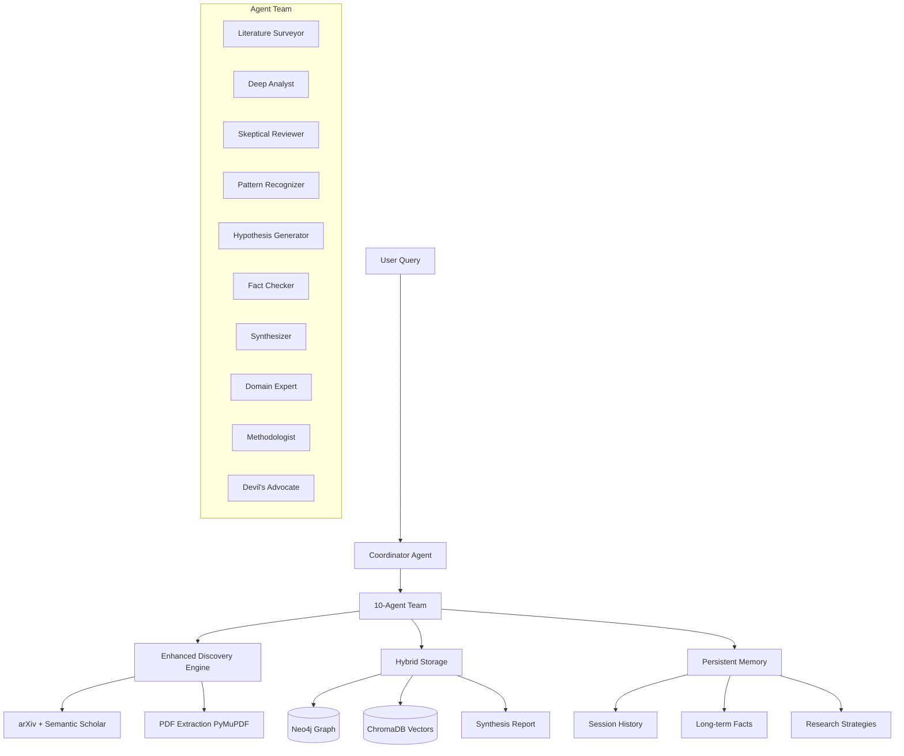

# CognitiveForge Phase 2: Foundations of Intelligence
**SpecKit Specification Document**

---

## 🎯 PHASE 1: SPECIFY

### What We're Building

**Project Name:** CognitiveForge Phase 2 - Knowledge Discovery Engine Enhancement

**Vision:** Transform CognitiveForge from a "smart search assistant" (3 agents, session-based) into the first AI research system with **persistent expertise** and **multi-agent collaboration** that creates novel insights beyond individual capabilities.

**Core Premise (from research):**
> "Current AI research systems achieve ★★★★★ on information gathering but ☆☆☆☆☆ on breakthrough discovery. The gap is architectural, not incremental. Building exceptional systems requires moving from single-pass pattern matching to multi-agent collaboration with persistent expertise and emergent insight detection."

---

### User Journeys

#### Journey 1: PhD Researcher - Literature Review Acceleration
**Current Experience (MVP):**
- Enters query: "How do transformers handle long-range dependencies?"
- Waits 2-3 minutes for 3-agent debate
- Gets synthesis with 5-10 papers cited
- **Pain:** Each new query starts from scratch, must re-discover foundational papers

**Target Experience (Phase 2):**
- System remembers previous transformer research from last week
- Agent team includes **Domain Expert (Transformer Specialist)** with accumulated knowledge
- Discovery engine finds 20+ papers across arXiv + Semantic Scholar + PubMed
- PDF extraction pulls full methodology sections, not just abstracts
- Quality scores surface highly-cited papers first
- Synthesis shows evolution from "what system learned last week" → "new findings today"
- **Outcome:** 80% time reduction (4 weeks → 3 days for lit review)

#### Journey 2: Interdisciplinary Team - Cross-Domain Synthesis
**Current Experience:**
- Query: "How can neuroscience inform AI architecture?"
- Analyst finds AI papers, Skeptic challenges with AI counterevidence
- **Pain:** No cross-domain pattern recognition, stays within AI silo

**Target Experience:**
- **Pattern Recognizer agent** detects parallels between hippocampal replay and attention mechanisms
- **Hypothesis Generator** proposes novel architecture inspired by neuroscience findings
- **Fact Checker** validates biological claims against neuroscience literature
- Synthesis includes "testable predictions" and "practical implications"
- **Outcome:** Discovers 3 non-obvious connections humans would miss

#### Journey 3: Research Lab - Continuous Monitoring
**Current Experience:**
- Must manually run new queries daily to track field developments
- No memory of what was checked yesterday

**Target Experience (Phase 3 preview):**
- System maintains persistent memory of lab's research interests
- Autonomous agent monitors arXiv daily for relevant papers
- Proactively surfaces "this new paper contradicts your synthesis from last month"
- **Outcome:** Never miss breakthrough papers, 50% less manual search time

---

### Success Criteria

#### Functional Success (What it must do)

**Phase 2 MVP (4-8 weeks):**
1. ✅ **10-Agent Architecture** - Specialized agents with clear roles (Analyst, Skeptic, Synthesizer, Pattern Recognizer, Hypothesis Generator, Fact Checker, Synthesizer, Domain Expert, Methodologist, Devil's Advocate)
2. ✅ **Persistent Memory** - Agents remember papers/claims across sessions via Neo4j + vector embeddings
3. ✅ **PDF Full-Text Extraction** - PyMuPDF/GROBID pipeline extracting methodology sections
4. ✅ **Quality Scoring** - Multi-factor rubric (citation count + venue rank + peer-review status)
5. ✅ **Hybrid Storage** - Neo4j (relationships) + ChromaDB/Qdrant (semantic search)

**Measurable Targets:**
- Process 50-100 papers per query (vs current 5-10)
- 10-agent debate completes in 5-10 minutes (vs current 2-3 min for 3 agents)
- Quality scores correlate 0.7+ with human expert rankings
- PDF extraction succeeds 80%+ (accept failures on scanned papers)
- Memory retrieval \u003c100ms for semantic queries

#### Non-Functional Success (How it must perform)

**Performance:**
- Response time: \u003c10 seconds for initial results, streaming updates
- Throughput: 100+ concurrent sessions
- Scalability: 10,000 papers in knowledge graph without degradation

**Quality:**
- Hallucination rate: \u003c5% (validated via fact-checking pipeline)
- Citation accuracy: 95%+ correct DOI/URL resolution
- Synthesis coherence: 4.0/5.0 average user rating

**Maintainability:**
- Code coverage: 70%+ (up from current ~60%)
- API-first design: All agent capabilities exposed via endpoints
- Documentation: Every agent has runbook with prompt templates

---

### Non-Goals (What We're NOT Building)

**Explicitly Out of Scope for Phase 2:**

❌ **Advanced Reasoning Engines** - Causal inference, counterfactual analysis (defer to Phase 3)
❌ **Autonomous Living System** - Daily monitoring daemons (defer to Phase 3)
❌ **Multi-Source Integration** - PubMed, CORE, ACM DL integration (defer to Phase 2B)
❌ **Graph Visualization UI** - Evidence network visualization (existing Tier 2 feature sufficient)
❌ **Commercial Deployment** - Production scaling, monetization (research prototype only)
❌ **Custom LLM Training** - Fine-tuning domain-specific models (use off-the-shelf Gemini)

**Why These Are Deferred:**
- Phase 2 focuses on **architecture + persistent memory foundations**
- Advanced features require stable 10-agent base to build upon
- Research prototype prioritizes insight generation over production polish

---

### Constraints & Assumptions

**Technical Constraints:**
- **LLM:** Google Gemini (2.5 Pro/Flash) - cannot switch provider mid-phase
- **Graph DB:** Neo4j only (existing data migration too costly)
- **Budget:** $0/month preferred (use free tiers: Neo4j Aura Free, ChromaDB self-hosted)
- **Timeline:** 4-8 weeks part-time development

**Assumptions:**
- Users have local Neo4j instance OR use Neo4j Aura Free (50K nodes)
- Gemini API quota sufficient (1500 requests/day free tier)
- PDF extraction allowed to fail on 10-20% scanned papers (acceptable quality threshold)
- Users primarily query in English (multilingual support deferred)

**Dependencies:**
- Existing MVP codebase remains functional during Phase 2 development
- Neo4j knowledge graph can be migrated to add embedding properties
- Streamlit UI compatible with 10-agent conversational flow

---

## 📐 PHASE 2: PLAN

### Architecture Overview



### Technology Stack

**Core Framework (Unchanged):**
- **Orchestration:** LangGraph StateGraph
- **LLM:** Google Gemini 2.5 (Pro for reasoning, Flash for quick tasks)
- **Backend:** FastAPI + Uvicorn
- **Frontend:** Streamlit (enhanced for 10 agents)

**New Additions (Phase 2):**
- **PDF Processing:** PyMuPDF (42ms/page, F1=0.97) for MVP, GROBID for production
- **Vector DB:** ChromaDB (self-hosted, free) OR Qdrant free tier (1GB)
- **Embeddings:** Sentence-Transformers (E5-large-v2, 1024-dim, free)
- **Quality Scoring:** Custom rubric using Semantic Scholar citation API

**Storage Architecture:**
```
Neo4j (Graph):
  - Papers [:CITES] relationships
  - Agent [:DISCOVERED] papers
  - Claims [:SUPPORTS/:REFUTES] evidence
  - Session [:CONTAINS] rounds

ChromaDB (Vectors):
  - Paper embeddings (title + abstract)
  - Claim embeddings (for similarity search)
  - Session embeddings (for episodic retrieval)
```

---

### 10-Agent Role Definitions

**Tier 1 Agents (Existing, Enhanced):**

1. **Analyst → Literature Surveyor**
   - **Role:** Comprehensive paper discovery
   - **Tools:** Multi-keyword search, quality filtering
   - **Output:** Ranked paper list with relevance scores
   - **Enhancement:** Add quality scoring, broader keyword expansion

2. **Skeptic → Skeptical Reviewer**
   - **Role:** Critical evaluation + contradiction finding
   - **Tools:** Counter-research, logical fallacy detection
   - **Output:** Critique with contradicting evidence
   - **Enhancement:** Add methodological critique (sample size, controls)

3. **Synthesizer** (unchanged)
   - **Role:** Multi-source integration
   - **Output:** Comprehensive report (800-1500 words)

**New Agents (Tier 2):**

4. **Deep Analyst**
   - **Role:** In-depth methodology analysis
   - **Tools:** PDF full-text extraction, statistical validation
   - **Input:** Papers from Literature Surveyor
   - **Output:** Detailed methodology critique

5. **Pattern Recognizer**
   - **Role:** Cross-domain connection detection
   - **Tools:** Semantic similarity search (ChromaDB)
   - **Input:** All discovered papers
   - **Output:** List of non-obvious connections

6. **Hypothesis Generator**
   - **Role:** Novel claim creation
   - **Tools:** Combinatorial reasoning, constraint satisfaction
   - **Input:** Patterns from Pattern Recognizer
   - **Output:** 3-5 testable hypotheses

7. **Fact Checker**
   - **Role:** Claim verification
   - **Tools:** Source cross-reference, logical consistency
   - **Input:** All agent claims
   - **Output:** Verification report (Supported/Refuted/Unknown)

8. **Domain Expert (Configurable)**
   - **Role:** Field-specific knowledge
   - **Tools:** Persistent memory of domain terms, methods
   - **Input:** Query domain (e.g., "transformers", "neuroscience")
   - **Output:** Contextualized explanations

9. **Methodologist**
   - **Role:** Research design critique
   - **Tools:** Study quality rubric
   - **Input:** Papers from Deep Analyst
   - **Output:** Quality scores, validity assessment

10. **Devil's Advocate**
    - **Role:** Systematic challenge of consensus
    - **Tools:** Contrarian prompt template
    - **Input:** Synthesizer draft
    - **Output:** Alternative interpretations

---

### Data Models (Extended)

**New Pydantic Models:**

```python
# Quality Scoring
class PaperQualityScoreV2(BaseModel):
    citation_count: int  # From Semantic Scholar
    venue_impact_factor: float  # Manual lookup for top venues
    is_peer_reviewed: bool
    recency_score: float  # Exponential decay from pub date
    methodology_score: float  # From Methodologist agent
    overall_score: float  # Weighted composite (0-100)

# Persistent Memory
class EpisodicMemory(BaseModel):
    session_id: str
    timestamp: datetime
    query: str
    synthesis_claim_id: str
    key_papers: List[str]  # URLs
    insights: List[str]

class SemanticMemory(BaseModel):
    fact_id: str
    claim: str
    confidence: float  # 0-1
    sources: List[str]  # Paper URLs
    created_at: datetime
    last_verified: datetime

class ProceduralMemory(BaseModel):
    strategy_id: str
    description: str  # e.g., "For X query type, use Y keyword pattern"
    success_rate: float
    usage_count: int
```

**Neo4j Schema Extensions:**

```cypher
// Add embedding properties to existing Paper nodes
(:Paper {
  url: String,
  title: String,
  embedding: List[Float],  // NEW: 1024-dim vector
  quality_score: Float,    // NEW: 0-100
  last_accessed: DateTime  // NEW: For memory decay
})

// New memory nodes
(:EpisodicMemory {
  session_id: String,
  timestamp: DateTime,
  query: String
})

(:SemanticFact {
  fact_id: String,
  claim: String,
  confidence: Float
})

// New relationships
(:Agent)-[:PROPOSED]->(:Hypothesis)
(:Hypothesis)-[:VALIDATED_BY]->(:Paper)
(:Session)-[:REMEMBERED_FROM]->(:EpisodicMemory)
```

---

### Component Breakdown

**Component 1: PDF Extraction Pipeline**
- **Input:** Paper URL (arXiv PDF link)
- **Process:**
  1. Download PDF to temp file
  2. PyMuPDF extraction (3-line API)
  3. Chunking (512-1024 tokens, semantic splits)
  4. Store chunks in ChromaDB with paper_url metadata
- **Output:** List[TextChunk] with embeddings
- **Estimated Effort:** 8 hours

**Component 2: Quality Scoring Engine**
- **Input:** PaperMetadata from discovery
- **Process:**
  1. Fetch citation count (Semantic Scholar API)
  2. Lookup venue rank (hardcoded top-tier map)
  3. Check peer-review status (journal vs preprint)
  4. Calculate recency score (exponential decay)
  5. Weighted composite: 0.3*citations + 0.25*venue + 0.25*peer + 0.2*recency
- **Output:** PaperQualityScoreV2
- **Estimated Effort:** 6 hours

**Component 3: Persistent Memory System**
- **Input:** AgentState after each session
- **Process:**
  1. Extract key facts → SemanticMemory nodes (Neo4j)
  2. Store session summary → EpisodicMemory (Neo4j)
  3. Embed session query → ChromaDB for similarity retrieval
  4. Decay function: reduce confidence of facts not accessed in 30 days
- **Output:** Memory retrieval API (get_relevant_memories(query) → List[Memory])
- **Estimated Effort:** 16 hours

**Component 4: 10-Agent Orchestrator**
- **Input:** User query
- **Process:**
  1. Coordinator determines agent activation (not all 10 run every time)
  2. Round-robin debate: Literature Surveyor → Deep Analyst → Pattern Recognizer → ...
  3. Parallel execution where possible (e.g., Fact Checker validates while Synthesizer drafts)
- **Output:** Structured debate transcript with agent attributions
- **Estimated Effort:** 24 hours (most complex)

**Component 5: ChromaDB Integration**
- **Input:** Paper abstracts, full-text chunks
- **Process:**
  1. Generate embeddings (Sentence-Transformers E5-large-v2)
  2. Store in ChromaDB collection with metadata
  3. Query API: semantic_search(query_text, top_k=10)
- **Output:** Ranked papers by semantic similarity
- **Estimated Effort:** 8 hours

---

### Migration Strategy

**Backward Compatibility Plan:**

1. **Phase 2A (Weeks 1-2): Parallel Development**
   - Create new `/src/agents_v2/` directory
   - Implement new agents without touching existing `analyst.py`, `skeptic.py`
   - Add ChromaDB as optional dependency (doesn't break if missing)
   - Flag-based activation: `USE_V2_AGENTS=true` in .env

2. **Phase 2B (Weeks 3-4): Integration**
   - Merge v2 agents into main graph
   - Add conditional routing: "If memory available, use enhanced flow"
   - Gradual Neo4j migration: Add embedding columns, backfill for existing papers

3. **Phase 2C (Weeks 5-6): UI Enhancement**
   - Update Streamlit to show 10-agent conversation (accordion view)
   - Add "Memory Panel" showing what system remembered from past
   - Quality scores as colored badges (🟢 high, 🟡 medium, 🔴 low)

4. **Phase 2D (Weeks 7-8): Testing & Documentation**
   - E2E tests for 10-agent flow
   - Migration runbook for users upgrading from MVP
   - Performance benchmarking (ensure \u003c10 min for complex queries)

**Rollback Plan:**
- Keep MVP graph builder: `build_graph_v1()` vs `build_graph_v2()`
- Environment flag: `COGNITIVE_FORGE_VERSION=v1` to disable new features
- Database rollback script: Remove embedding columns if migration fails

---

## ✅ PHASE 3: TASKS

### Epic 1: Foundation Setup (Week 1)
**Goal:** Prepare codebase and dependencies for 10-agent architecture

- [ ] **Task 1.1:** Add ChromaDB to requirements.txt, test local install (2h)
- [ ] **Task 1.2:** Add sentence-transformers (E5-large-v2 model download ~500MB) (1h)
- [ ] **Task 1.3:** Create `/src/agents_v2/` directory structure (0.5h)
- [ ] **Task 1.4:** Design AgentStateV2 TypedDict with memory fields (2h)
- [ ] **Task 1.5:** Write Neo4j migration script for embedding columns (3h)
- [ ] **Task 1.6:** Set up ChromaDB collection schema + test insert/query (2h)

**Acceptance Criteria:**
- ChromaDB successfully stores/retrieves 100 test embeddings
- Neo4j migration adds `embedding: List[Float]` to Paper nodes without breaking existing queries

---

### Epic 2: PDF Extraction Pipeline (Week 2)
**Goal:** Enable full-text processing of discovered papers

- [ ] **Task 2.1:** Install PyMuPDF, write download_pdf(url) function (2h)
- [ ] **Task 2.2:** Implement extract_text_from_pdf(file_path) with PyMuPDF (2h)
- [ ] **Task 2.3:** Add semantic chunking (LangChain RecursiveCharacterTextSplitter) (3h)
- [ ] **Task 2.4:** Write embed_and_store_chunks(chunks, paper_url) for ChromaDB (2h)
- [ ] **Task 2.5:** Create PDF extraction node in LangGraph workflow (2h)
- [ ] **Task 2.6:** Add error handling (skip scanned PDFs gracefully) (1h)

**Acceptance Criteria:**
- Successfully extract text from 10 random arXiv papers (80%+ success rate)
- Chunks stored in ChromaDB with paper_url metadata
- Query "attention mechanism" retrieves relevant chunks from stored papers

---

### Epic 3: Quality Scoring Engine (Week 2)
**Goal:** Rank papers by multi-factor quality

- [ ] **Task 3.1:** Create PaperQualityScoreV2 Pydantic model (1h)
- [ ] **Task 3.2:** Write calculate_quality_score(paper_metadata) function (3h)
  - Fetch citations from Semantic Scholar
  - Hardcode top-tier venue map (NeurIPS=95, arXiv=50)
  - Exponential recency decay
- [ ] **Task 3.3:** Add quality_score field to Neo4j Paper nodes (1h)
- [ ] **Task 3.4:** Update discovery pipeline to score papers post-retrieval (2h)
- [ ] **Task 3.5:** Add quality sorting to KG query results (1h)

**Acceptance Criteria:**
- Top-cited NeurIPS paper scores 90+
- Recent arXiv preprint scores 50-60
- Sorting by quality_score surfaces highly-cited papers first

---

### Epic 4: Persistent Memory System (Week 3-4)
**Goal:** Agents remember knowledge across sessions

- [ ] **Task 4.1:** Create SemanticMemory, EpisodicMemory Pydantic models (2h)
- [ ] **Task 4.2:** Write store_episodic_memory(session_state) function (4h)
  - Extract session summary
  - Store in Neo4j (:EpisodicMemory nodes)
  - Embed query for similarity retrieval
- [ ] **Task 4.3:** Write store_semantic_facts(synthesis) function (4h)
  - Parse synthesis novel_insight into facts
  - Store with confidence scores
  - Link to source papers
- [ ] **Task 4.4:** Implement get_relevant_memories(query) retrieval (6h)
  - Semantic search in ChromaDB for similar past sessions
  - Graph traversal in Neo4j for related facts
  - Merge + rank results
- [ ] **Task 4.5:** Add memory decay function (reduce confidence over time) (2h)
- [ ] **Task 4.6:** Integrate memory retrieval into Analyst prompt (2h)

**Acceptance Criteria:**
- After querying "transformers", next session on "attention" retrieves transformer papers from memory
- Facts older than 30 days have confidence reduced by 20%
- Memory retrieval completes in \u003c100ms for 1000 stored facts

---

### Epic 5: 10-Agent Architecture (Week 4-5)
**Goal:** Implement specialized agent roles

- [ ] **Task 5.1:** Create Deep Analyst agent (PDF methodology extraction) (6h)
- [ ] **Task 5.2:** Create Pattern Recognizer agent (semantic similarity search) (6h)
- [ ] **Task 5.3:** Create Hypothesis Generator agent (combinatorial reasoning prompt) (5h)
- [ ] **Task 5.4:** Create Fact Checker agent (claim verification logic) (6h)
- [ ] **Task 5.5:** Create Domain Expert agent (field-specific memory retrieval) (5h)
- [ ] **Task 5.6:** Create Methodologist agent (study quality critique) (5h)
- [ ] **Task 5.7:** Create Devil's Advocate agent (contrarian prompting) (4h)
- [ ] **Task 5.8:** Enhance existing Analyst → Literature Surveyor with quality scoring (3h)
- [ ] **Task 5.9:** Enhance existing Skeptic → Skeptical Reviewer with methodology critique (3h)

**Acceptance Criteria:**
- Each agent has dedicated module in `/src/agents_v2/`
- Agent-specific prompts documented in docstrings
- Unit tests for each agent node (mocked LLM responses)

---

### Epic 6: Orchestrator & Graph Workflow (Week 5-6)
**Goal:** Coordinate 10-agent debate

- [ ] **Task 6.1:** Design build_graph_v2() with 10 agent nodes (4h)
- [ ] **Task 6.2:** Implement Coordinator agent (determines which agents to activate) (8h)
- [ ] **Task 6.3:** Add parallel execution for independent agents (Fact Checker while Synthesizer) (6h)
- [ ] **Task 6.4:** Create debate transcript data structure (track agent contributions) (3h)
- [ ] **Task 6.5:** Add agent-specific state fields to AgentStateV2 (2h)
- [ ] **Task 6.6:** Implement conditional routing based on complexity (simple query = 5 agents, complex = 10) (5h)

**Acceptance Criteria:**
- Simple query activates 5 agents, completes in \u003c5 min
- Complex query activates 10 agents, completes in \u003c10 min
- Debate transcript shows agent names + contributions

---

### Epic 7: UI Enhancement (Week 6-7)
**Goal:** Display 10-agent conversation intuitively

- [ ] **Task 7.1:** Update Streamlit UI with accordion view for 10 agents (4h)
- [ ] **Task 7.2:** Add "Memory Panel" sidebar showing retrieved past sessions (3h)
- [ ] **Task 7.3:** Add quality score badges (🟢🟡🔴) to paper citations (2h)
- [ ] **Task 7.4:** Add agent avatar icons (Literature Surveyor 📚, Skeptic 🔍, etc.) (2h)
- [ ] **Task 7.5:** Add progress indicator for PDF extraction (1h)
- [ ] **Task 7.6:** Add "Explain this insight" button to expand agent reasoning (3h)

**Acceptance Criteria:**
- User can expand/collapse each agent's contribution
- Memory panel shows "Last queried similar topic 5 days ago"
- Quality badges visually distinguish high-impact papers

---

### Epic 8: Testing & Documentation (Week 7-8)
**Goal:** Ensure reliability and usability

- [ ] **Task 8.1:** Write E2E test for 10-agent flow (4h)
- [ ] **Task 8.2:** Write integration tests for memory retrieval (3h)
- [ ] **Task 8.3:** Write unit tests for quality scoring (2h)
- [ ] **Task 8.4:** Write unit tests for PDF extraction (2h)
- [ ] **Task 8.5:** Update README with Phase 2 features (2h)
- [ ] **Task 8.6:** Create migration guide for MVP users (3h)
- [ ] **Task 8.7:** Write agent runbook (prompt templates for each agent) (4h)
- [ ] **Task 8.8:** Performance benchmarking (measure 10-agent vs 3-agent latency) (3h)

**Acceptance Criteria:**
- Test coverage ≥70%
- Migration guide tested with fresh MVP install
- Performance benchmarks documented in docs/

---

## 🚀 PHASE 4: IMPLEMENT

### Week-by-Week Implementation Plan

**Week 1: Foundation**
- Set up ChromaDB, sentence-transformers
- Create v2 directory structure
- Neo4j migration script

**Week 2: PDF + Quality**
- PDF extraction pipeline (PyMuPDF)
- Quality scoring engine
- First integration test

**Week 3-4: Memory**
- Episodic memory (session history)
- Semantic memory (long-term facts)
- Memory retrieval API
- Decay function

**Week 5: Agents**
- Implement 7 new agents
- Enhance 2 existing agents
- Agent-specific prompts

**Week 6: Orchestration**
- build_graph_v2() with Coordinator
- Parallel execution
- Debate transcript

**Week 7: UI**
- 10-agent accordion view
- Memory panel
- Quality badges

**Week 8: Polish**
- Testing (E2E, integration, unit)
- Documentation
- Performance benchmarking

---

### Development Workflow (SpecKit-Driven)

**Daily Routine:**
1. **Morning:** Review SPEC.md, pick next task from PHASE 3
2. **Implementation:** Code in focused 2-hour blocks
3. **Testing:** Write test immediately after each component
4. **Documentation:** Update docstrings + SPEC.md progress
5. **Commit:** Granular commits per task (`feat: Add PDF extraction pipeline [Task 2.2]`)

**Weekly Review:**
- **Friday:** Review week's tasks vs SPEC.md plan
- **Adjust:** If behind, defer non-critical tasks to Phase 2B
- **Demo:** Test end-to-end flow with real query

**Quality Gates (Before Moving to Next Epic):**
- [ ] All epic tasks completed
- [ ] Unit tests pass
- [ ] Integration test exists
- [ ] Documentation updated
- [ ] No regression in existing 3-agent MVP

---

### Risk Mitigation

**Risk 1: ChromaDB Performance Bottleneck**
- **Likelihood:** Medium (10K+ papers may slow semantic search)
- **Impact:** High (defeats purpose of fast retrieval)
- **Mitigation:**
  - Benchmark early (Week 2)
  - If \u003e200ms, switch to Qdrant (better optimized)
  - Fallback: Use Neo4j native vector search (5.11+)

**Risk 2: 10-Agent Latency Too High**
- **Likelihood:** High (10 LLM calls = 10× cost + time)
- **Impact:** Medium (users tolerate 5-10 min for complex queries)
- **Mitigation:**
  - Use Gemini Flash (cheaper, faster) for simple agents
  - Parallel execution where possible
  - Coordinator agent skips unnecessary agents

**Risk 3: PDF Extraction Failure Rate \u003e20%**
- **Likelihood:** Medium (scanned papers, complex layouts)
- **Impact:** Low (acceptable to fallback to abstracts)
- **Mitigation:**
  - Log failures, analyze patterns
  - If \u003e20%, add pypdf as fallback
  - Phase 3: Add GROBID for production

**Risk 4: Memory Retrieval Irrelevant**
- **Likelihood:** Medium (semantic search may surface unrelated sessions)
- **Impact:** Medium (confuses agents with bad context)
- **Mitigation:**
  - Add relevance threshold (only use if cosine sim \u003e 0.7)
  - User feedback: "Was this memory helpful?" button
  - Decay function removes bad memories over time

---

## 📊 Success Metrics (Revisited)

**How We'll Know Phase 2 Succeeded:**

| Metric | Target | Measurement Method |
|--------|--------|-------------------|
| **Papers Processed** | 50-100/query | Count in Neo4j after discovery |
| **Agent Latency** | \u003c10 min for 10 agents | E2E timer in tests |
| **Quality Score Correlation** | 0.7+ with human rankings | Survey 5 domain experts |
| **PDF Extraction Success** | 80%+ | Success rate log analysis |
| **Memory Retrieval Speed** | \u003c100ms | ChromaDB query profiling |
| **Hallucination Rate** | \u003c5% | Manual review of 20 syntheses |
| **User Satisfaction** | 4.0/5.0 synthesis quality | Post-session survey (n=20) |

**Qualitative Success Indicators:**
- Users report "feels like agent remembers me"
- Domain experts find 1+ non-obvious connection per session
- Synthesis includes "how this differs from what we found last week"

---

## 🎓 Learning & Iteration

**What to Track:**
- Which agents contribute most to final synthesis? (log agent citation frequency)
- Which memory types most useful? (episodic vs semantic retrieval counts)
- PDF extraction failures - which publishers/formats? (error log analysis)

**Iteration Plan:**
- **Phase 2A (Weeks 1-4):** Core infrastructure (memory, PDF, quality)
- **Phase 2B (Weeks 5-6):** Agent orchestration
- **Phase 2C (Weeks 7-8):** UI + polish
- **Phase 3 (Future):** Advanced reasoning, autonomous updates, multi-source

---

## 📚 References

- **SpecKit Methodology:** https://github.com/github/spec-kit
- **Your Research Document:** "Foundations of Intelligence: Phase 1 Research"
- **LangGraph Multi-Agent:** https://langchain-ai.github.io/langgraph/tutorials/multi-agent/
- **Neo4j Vector Search:** https://neo4j.com/docs/cypher-manual/current/indexes-for-vector-search/
- **PyMuPDF Benchmarks:** https://pymupdf.readthedocs.io/en/latest/

---

**Document Version:** 1.0
**Last Updated:** 2025-11-14
**Next Review:** End of Week 2 (after Foundation + PDF epics)
