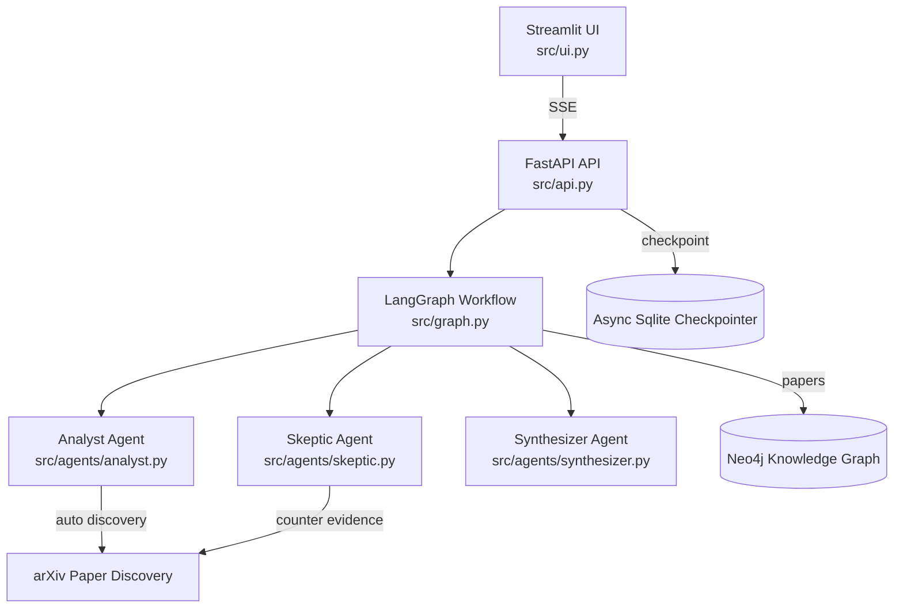

# CognitiveForge

Real-time multi-agent research assistant that debates itself to deliver transparent, citation-backed insights. Built for the Hack-Nation Global AI Hackathon.

---

## 🔥 Elevator Pitch

CognitiveForge orchestrates three Google Gemini–powered agents inside LangGraph. The Analyst proposes a thesis with citations, the Skeptic hunts for contradictions by triggering live paper discovery, and the Synthesizer resolves the debate into a structured report. FastAPI streams every turn to a polished Streamlit UI, so users can watch the argument evolve, expand reasoning, and follow hyperlink-rich citations. Neo4j tracks knowledge graph memory, ensuring every claim remains traceable.

---

## 📚 Table of Contents

1. [Key Features](#key-features)  
2. [Architecture Overview](#architecture-overview)  
3. [Quick Start](#quick-start)  
4. [Environment Variables](#environment-variables)  
5. [Running the System](#running-the-system)  
6. [Testing](#testing)  
7. [Roadmap](#roadmap)  
8. [Team](#team)

---

## ✅ Key Features

- **Dialectical Debate Loop** – Analyst, Skeptic, and Synthesizer agents execute a cyclic LangGraph workflow with natural termination when debates converge or get stuck.
- **Automatic Paper Discovery** – arXiv integration (demo mode) surfaces supporting and counter evidence; results are persisted to Neo4j.
- **Real-Time Visibility** – Server-Sent Events drive a Streamlit conversational layout that renders each message instantly and enriches inline citations.
- **Structured Outputs** – Pydantic models enforce type-safe agent responses; a simplified synthesis schema bypasses Gemini’s schema limits while keeping final reports rich.
- **Traceable Memory** – Neo4j stores papers, claims, syntheses, and [:CITES] relationships, enabling provenance checks and future Tier-2 visualizations.
- **Production-Ready Foundations** – AsyncSqliteSaver checkpointing, modular utils (`paper_quality`, `sse_events`), and Docker-compose scaffolding for deployment.

---

## 🧠 Architecture Overview



Supporting services: Neo4j stores evidence and syntheses, the AsyncSqliteSaver preserves graph state, and the arXiv integration powers demo-safe discovery.

**Data Flow**
1. Streamlit sends a query to `/stream_dialectics/{thread_id}` with the research question.  
2. FastAPI starts auto-discovery (arXiv) and streams discovery events.  
3. LangGraph executes Analyst → Skeptic → Synthesizer iterations, emitting SSE updates after each node.  
4. Streamlit updates the conversational view in real time and renders the final synthesis card.  
5. Neo4j stores papers, counter evidence, and synthesized insights for traceability.

---

## ⚡ Quick Start

Prerequisites:
- Python 3.11+
- `pip` or `uv` for dependency management
- Google Gemini API key with access to 2.5 Pro / Flash
- Optional: Local Neo4j instance (defaults provided in `.env.example`)

```bash
# 1. Clone the repository
git clone https://github.com/richelgomez99/CognitiveForge.git
cd CognitiveForge

# 2. Create and activate a virtual environment
python3 -m venv .venv
source .venv/bin/activate  # Windows: .venv\Scripts\activate

# 3. Install dependencies
pip install --upgrade pip
pip install -r requirements.txt

# 4. Configure environment variables
cp .env.example .env
# Edit .env with your Google API key and optional Neo4j credentials
```

---

## 🔐 Environment Variables

| Variable | Description |
| --- | --- |
| `API_KEY` | X-API-Key used by Streamlit to call FastAPI |
| `GOOGLE_API_KEY` | Gemini API key (required) |
| `GEMINI_MODEL_ANALYST` | Analyst model ID (default `gemini-2.5-pro`) |
| `GEMINI_MODEL_SKEPTIC` | Skeptic model ID (default `gemini-2.5-flash`) |
| `GEMINI_MODEL_SYNTHESIZER` | Synthesizer model ID (default `gemini-2.5-pro`) |
| `ARXIV_ONLY` | Set `true` to disable Semantic Scholar (demo-safe) |
| `NEO4J_URI` / `NEO4J_USER` / `NEO4J_PASSWORD` | Knowledge graph connection |

The UI also respects `st.secrets["API_KEY"]` when deployed on Streamlit Cloud.

---

## ▶️ Running the System

### Start the backend API
```bash
uvicorn src.api:app --host 0.0.0.0 --port 8000 --reload
```
> Tip: this initializes the AsyncSqliteSaver checkpointer and caches the LangGraph workflow.

### Launch the Streamlit UI
```bash
streamlit run src/ui.py --server.port 8501
```

1. Enter a research question (e.g., “How do neural networks generalize?”).  
2. Watch discovery events and debate messages stream live.  
3. Expand “View Reasoning” / “View Critique” to read enriched citations.  
4. Review the final synthesis card with insight, metrics, and supporting evidence.

### Optional: Docker
A `docker-compose.yml` is included for future deployment, though the hackathon build ran locally.

---

## ✅ Testing

```bash
pytest               # Fast unit tests
pytest tests/e2e     # Longer integration tests (LLM-dependent, requires API key)
```

LLM endpoints are mocked where possible; set `GOOGLE_API_KEY` in `.env` to exercise full end-to-end flows.

---

## 🗺️ Roadmap

- **Tier 2**: Evidence graph visualization (Plotly) and quality indicators (citation impact scores).  
- **Tier 3**: “Living system” daemon that monitors Neo4j for new claims and replays debates proactively.  
- **Semantic Scholar Reintegration**: Adaptive rate limiting and cached keyword expansion.  
- **Advanced UI**: Potential Streamlit + shadcn hybrid using ObservedObserver/streamlit-shadcn-ui components.

---

## 👤 Builder

- Richel Gomez – Architecture, LangGraph workflow, FastAPI backend, real-time UI, documentation

> Questions or feedback? Open an issue or reach out on the Hack-Nation Discord.

---

Happy forging! 🧠🔥
